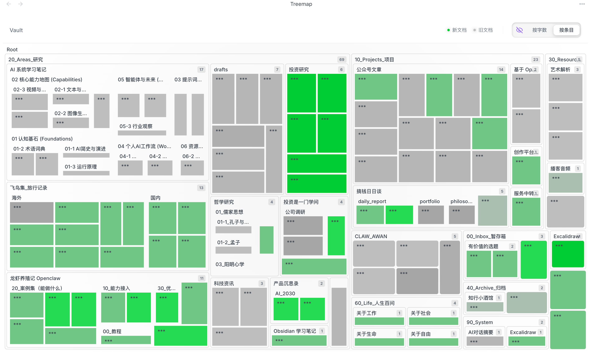
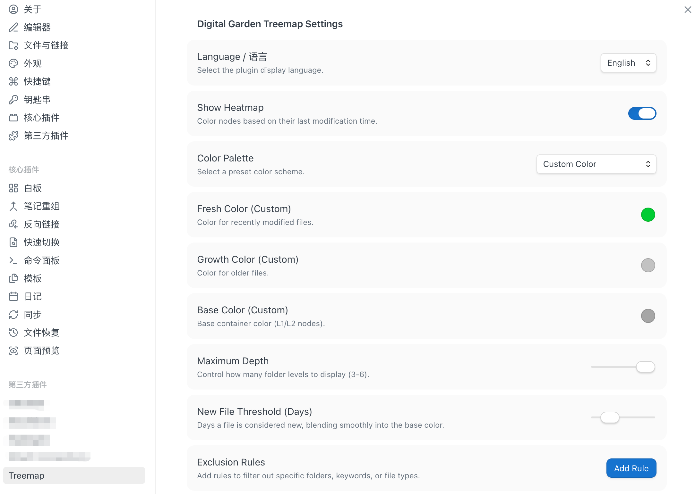

# Treemap Plugin

[English](#english) | [简体中文](#简体中文)

---

## 简体中文

Treemap 是一款极致极简、美感十足的矩阵图插件。它将您的笔记库视作一座数字花园，通过动态的色块分布，让您一眼洞察知识的深度与生命力。

### 核心特性
- **双向视界**：
  - **按字数**：根据文档规模分配权重，核心长文一目了然。
  - **按条目**：GitHub 风格热力图，全景展现文档分布。
- **物理即正义**：基于惯性阻尼的 UI 动画，如丝般顺滑的交互感。
- **多维度图例**：动态显示新文档与旧文档的更新状态。
- **全景观排除系统**：支持路径、关键词、后缀三重匹配规则。
- **极致设计**：支持 Glassmorphism 磨砂玻璃特效，完美契合现代审美。

### 安装方法
1. 前往 GitHub Releases 下载最新的 `main.js`, `manifest.json`, `styles.css`。
2. 在您的插件目录中，创建目录 `treemap`。
3. 将下载的文件放入该目录。
4. 在设置中重启并启用插件。

---

## English

Treemap is a premium, aesthetic visualization plugin for your vault. It treats it as a digital garden, allowing you to perceive the depth and vitality of your knowledge thru dynamic color blocks.

### Key Features
- **Dual Perspective**:
  - **Sizing by Chars**: Visualizes document weight based on content length.
  - **Equal Sizing**: GitHub-style heatmap for overall vault landscape.
- **Physics-based Motion**: Smooth transitions with inertia and damping effects.
- **Dynamic Legend**: Real-time status visualization for new and old documents.
- **Robust Exclusion**: Advanced filtering by Path, Keyword, or Extension.
- **Premium UI**: Glassmorphism and sub-pixel perfection.

---

## Submission Guide (For Author)

To submit this plugin to the Obsidian Community Store:

1. **GitHub Repo**: Create a repository named `obsidian-treemap`.
2. **Release**: Create a GitHub Release with the tag `1.0.0`. Upload `main.js`, `manifest.json`, and `styles.css`.
3. **Official Repo**: Fork [obsidian-releases](https://github.com/obsidianmd/obsidian-releases).
4. **Edit**: Add this plugin's metadata to `community-plugins.json`.
5. **PR**: Open a Pull Request to the `obsidianmd/obsidian-releases` repository.
